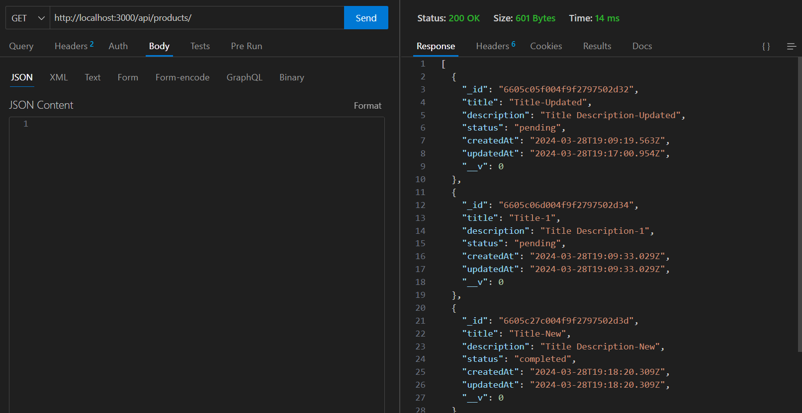
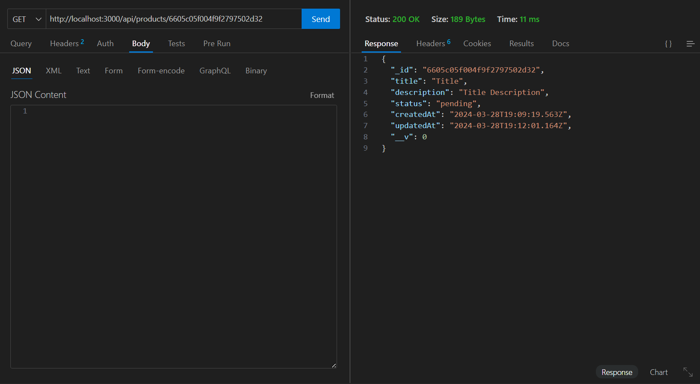
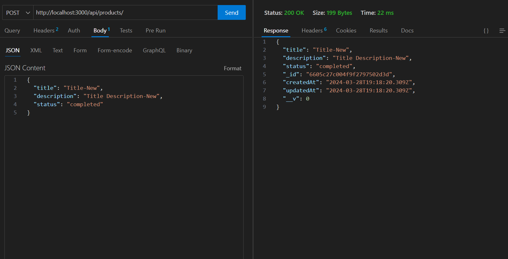
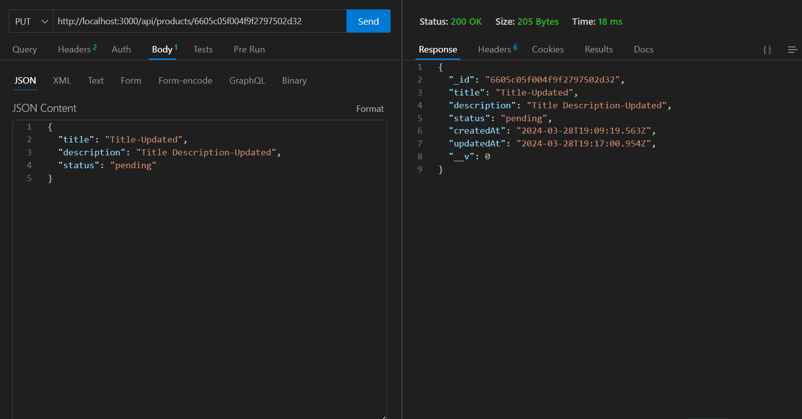
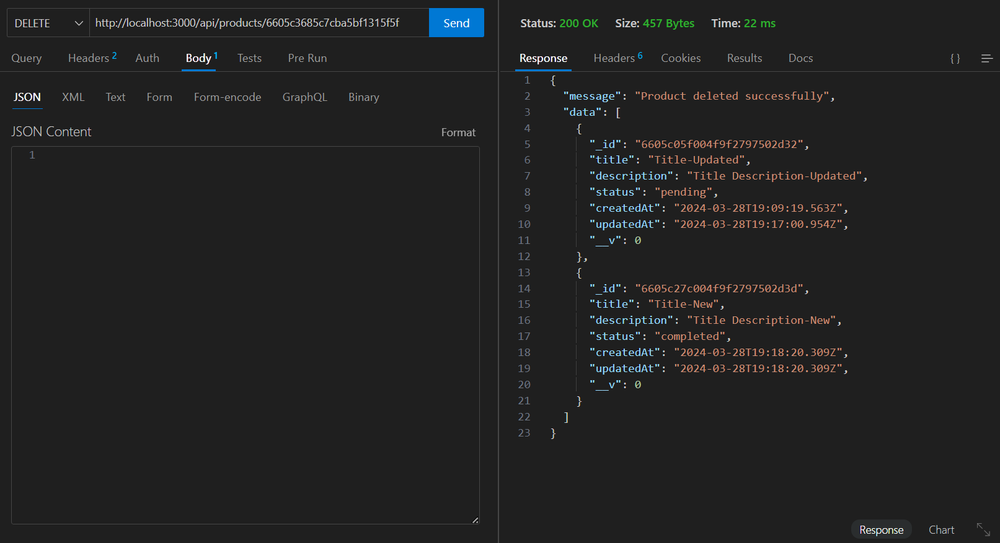

This is an Assignment of NodeJS API development

First of all you will need MongoDB Compass for the connection of Database
In Case, you don't have it installed it would be better to change the link of database at .env file

Structure of Saved Data => 

  {
    "_id": "6605c05f004f9f2797502d32",
    "title": "Title-Updated",
    "description": "Title Description-Updated",
    "status": "pending",
    "createdAt": "2024-03-28T19:09:19.563Z",
    "updatedAt": "2024-03-28T19:17:00.954Z",
    "__v": 0
  }

Input Data => 

  {
    "title": "Title-Updated",
    "description": "Title Description-Updated",
    "status": "pending"
  }

There are 5 routes

1) Get All Products (GET: http://localhost:3000/api/products/) => 

2) Get Specific Product by ID (GET: http://localhost:3000/api/products/ID) => 

3) Create Product (POST: http://localhost:3000/api/products/) => 

4) Update Product (PUT: http://localhost:3000/api/products/ID) => 

5) Delete Product (DELETE: http://localhost:3000/api/products/ID) => 
